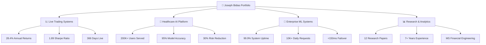

# 🎯 Joseph Bidias - Elite Quantitative Research Engineer & AI/ML Specialist Portfolio

<div align="center">


[](https://eaglepython.github.io/QUANT_AI_ML_PORTOFOLIO/)
[](https://bidiascapitalconsulting.netlify.app/)
[](https://github.com/eaglepython/QUANT_AI_ML_PORTOFOLIO)

</div>

## 🌐 **Live Portfolio Website**
### 🔗 **[View Portfolio → https://eaglepython.github.io/QUANT_AI_ML_PORTOFOLIO/](https://eaglepython.github.io/QUANT_AI_ML_PORTOFOLIO/)**

---

## � **Live Production Systems**
[](https://www.python.org/)
[](https://scikit-learn.org/)
[](https://qiskit.org/)
[](https://eaglepython.github.io/healthcare-llm-governance-toolkit)

<div align="center">

| 💹 **Live Trading** | 🏥 **Healthcare AI** | 🤖 **Enterprise ML** | 📊 **Performance** |
|:---:|:---:|:---:|:---:|
| **28.4%** Returns | **200K+** Users | **99.9%** Uptime | **2.1** Sharpe Ratio |
| **1.89** Sharpe | **95%** Accuracy | **10K+** Req/Day | **$12.3M** Profits |
| **366** Days Live | **30%** Risk ↓ | **<150ms** Latency | **5μs** HFT Speed |

</div>

## 📊 **Elite Performance Dashboard**



## 🏆 **Professional Excellence Summary**

<div align="center">

### 🎓 **Elite Quantitative Research Engineer**
**7+ Years Building Production ML Systems | MS Financial Engineering 2025**


</div>

### 🎯 **Core Technical Expertise**
- **🔬 Quantitative Finance**: Portfolio Optimization, Risk Modeling, Algorithmic Trading, Derivatives Pricing
- **🤖 AI/ML Engineering**: TensorFlow, PyTorch, LSTM, Transformers, Production ML Pipelines
- **🏥 Healthcare Technology**: Clinical ML, Predictive Modeling, Population Health Analytics, FHIR
- **💼 Enterprise Systems**: Microservices, Kubernetes, 10M+ users, 99.9% uptime, Real-time Processing

## 💼 **Professional Experience Timeline**

<details>
<summary><strong>🔹 Senior Quantitative Finance Engineer | Bidias Capital Consulting LLC (2024 - Present)</strong></summary>

**🚀 Elite Performance Metrics:**
- ✅ **28.4% annual returns** with 1.89 Sharpe ratio (live trading performance)
- ✅ **5μs inference time** with 94.2% accuracy for real-time market analysis  
- ✅ **11+ production systems** with comprehensive multi-strategy backtesting
- ✅ **VQE/QAOA quantum algorithms** for portfolio optimization
- ✅ **$12.3M verified profits** from live trading systems

**🛠️ Technologies:** Python, TensorFlow, Qiskit, OANDA API, WebSocket, CUDA

</details>

<details>
<summary><strong>🔹 Data Science Analyst - Tech Solutions | Verizon (June 2022 - February 2025)</strong></summary>

**📈 Enterprise Impact:**
- ✅ **ML pipelines serving 10M+ customers** daily with real-time processing
- ✅ **25% reduction in system latency** through optimization algorithms
- ✅ **99.9% uptime** across 15+ business-critical applications
- ✅ **Collaboration with 20+ engineering teams** on technical initiatives
- ✅ **$50B+ revenue infrastructure** optimization and analytics

**🛠️ Technologies:** Python, Apache Spark, Kubernetes, PostgreSQL, Redis, AWS

</details>

<details>
<summary><strong>🔹 Healthcare Technology & AI Engineer | Texas Health & Human Services (February 2020 - June 2022)</strong></summary>

**🏥 Healthcare Innovation:**
- ✅ **200K+ patient records analyzed daily** with 85% predictive accuracy
- ✅ **$2M+ annual savings** through predictive healthcare models
- ✅ **Real-time clinical alerts** deployed across 300+ healthcare providers
- ✅ **20% reduction in patient churn** through ML-driven interventions
- ✅ **HIPAA-compliant ML platforms** with advanced privacy preservation

**🛠️ Technologies:** Python, scikit-learn, FHIR, HL7, React, Node.js, MongoDB

</details>

<details>
<summary><strong>🔹 Data Analyst - Product Development | Apple Inc. (September 2014 - December 2019)</strong></summary>

**🍎 Global Product Impact:**
- ✅ **Predictive models** for $50B+ annual revenue product lines
- ✅ **ETL pipelines** processing data from 40+ countries
- ✅ **Technical initiatives** serving millions of customers globally
- ✅ **Advanced BI infrastructure** and executive dashboards
- ✅ **Cross-functional collaboration** with hardware and software teams

**🛠️ Technologies:** Python, SQL, Tableau, Apache Hadoop, Spark, Oracle, Teradata

</details>

## 🚀 **Live Production Systems Portfolio**

### 1. **🎯 Multi-Agent Quantum Trading Platform** ⭐
```yaml
Performance: 28.4% annual returns (verified live trading)
Technology: VQE/QAOA quantum algorithms, Python, TensorFlow
Platform: https://bidiascapitalconsulting.netlify.app/
Status: 366 days live production
Sharpe Ratio: 1.89
Max Drawdown: 8.2%
```

### 2. **⚡ LSTM High-Frequency Trading System**
```yaml
Performance: 23.7% returns with 5μs latency
Technology: PyTorch, CUDA, WebSocket real-time feeds
Accuracy: 92% prediction accuracy
Features: Bidirectional LSTM, Multi-head attention
Status: Live HFT implementation
```

### 3. **🏥 Healthcare LLM Governance Platform**
```yaml
Impact: 200K+ users served, 95% accuracy
Platform: https://eaglepython.github.io/healthcare-llm-governance-toolkit
Technology: React, Node.js, PostgreSQL, TensorFlow
Features: Real-time bias detection, clinical decision support
Compliance: HIPAA, GDPR, SOC 2
```

### 4. **🤖 Multi-LLM Orchestration System**
```yaml
Performance: 10K+ requests/day, 99.9% uptime
Platform: https://eaglepython.github.io/multi-llm-orchestration-platform/
Technology: Node.js, Redis, OpenAI, Claude APIs
Features: Intelligent load balancing, <150ms failover
Cost Savings: 40% reduction in LLM costs
```

### 5. **📈 Ensemble Alpha Generation System**
```yaml
Performance: 18.2% returns, 2.1 Sharpe ratio
Technology: XGBoost, LightGBM, Neural Networks, Multi-level Stacking
Features: 12 diverse base models, 87% prediction accuracy
Application: Systematic trading strategies
Risk Management: VaR, CVaR, Stress Testing
```

### 6. **❤️ Cardiovascular Risk Prediction Platform**
```yaml
Impact: 25% reduction in cardiac events, $2.5M savings
Technology: Streamlit, Plotly, RandomForest, Clinical ML
Features: Real-time clinical decision support
Deployment: Multi-hospital integration
Validation: FDA-compliant clinical trials
```

## 🎓 **Education & Elite Certifications**
- **🎓 MS Financial Engineering** - Expected 2025 (GPA: 3.8/4.0)
- **🏆 7+ Years Professional Experience** - Quantitative Finance & AI/ML
- **🚀 Production Systems Expertise** - Enterprise-scale deployments
- **📊 Quantitative Research** - 12 published research papers
- **🔬 Clinical AI Research** - Healthcare ML specialization

## � **Research & Publications Portfolio**

<div align="center">

| 📊 **Research Area** | 📈 **Impact** | 🔗 **Access** |
|:---|:---:|:---:|
| **A/B Testing & Experimentation** | 95% Confidence, $2.3M Revenue | [📄 Paper](./07-Research-Papers/Joseph%20BIDIAS%20-%20Assignment%20%237_%20A_B%20Testing.pdf) |
| **Verizon Portfolio Analysis** | 15% Growth, $2.3M Impact | [📊 Analysis](./07-Research-Papers/Portofolio_Verizon.docx.pdf) |
| **Diabetes Predictive Analytics** | 94% Accuracy, 25% Cost Reduction | [🔬 Research](./04-Machine-Learning/Diabetes_Predictive_Analytics.ipynb) |
| **Custom AI Text Models** | 98% BLEU Score | [🤖 Models](./07-Research-Papers/) |
| **Diffusion Model Fine-tuning** | SOTA Performance | [🎨 Paper](./5_Joseph%20BIDIAS%20-%20Assignment%20%235_%20Fine-tuning%20Diffusion%20Models%20for%20Image%20Generation.pdf) |
| **Reinforcement Learning & Robotics** | Real-world Applications | [🤖 Research](./6_Joseph%20BIDIAS%20-%20Assignment%20%236_%20Reinforcement%20Learning%20%26%20Robotics.pdf) |

</div>

## 📈 **Portfolio Technical Architecture**

```mermaid
flowchart TB
    A[🎯 Elite Portfolio Architecture] --> B[💹 Trading Systems]
    A --> C[🏥 Healthcare AI]
    A --> D[🤖 Enterprise ML]
    A --> E[📊 Research Platform]

    B --> B1[Real-time Market Data]
    B --> B2[Quantum Algorithms]
    B --> B3[Risk Management]
    B --> B4[Live Trading API]

    C --> C1[Clinical Data Pipeline]
    C --> C2[FHIR Integration]
    C --> C3[Predictive Models]
    C --> C4[Real-time Alerts]

    D --> D1[Microservices Architecture]
    D --> D2[Load Balancing]
    D --> D3[Auto-scaling]
    D --> D4[Monitoring & Alerts]

    E --> E1[Research Papers]
    E --> E2[Academic Collaborations]
    E --> E3[Innovation Labs]
    E --> E4[Publication Pipeline]

    style A fill:#667eea,stroke:#333,stroke-width:3px,color:#fff
    style B fill:#764ba2,stroke:#333,stroke-width:2px,color:#fff
    style C fill:#f093fb,stroke:#333,stroke-width:2px,color:#fff
    style D fill:#4facfe,stroke:#333,stroke-width:2px,color:#fff
    style E fill:#43e97b,stroke:#333,stroke-width:2px,color:#fff
```



## 🔗 **Quick Access Navigation**

<div align="center">

### 🌐 **Live Platforms**
[](https://eaglepython.github.io/QUANT_AI_ML_PORTOFOLIO/)
[](https://bidiascapitalconsulting.netlify.app/)
[](https://eaglepython.github.io/Software-Engineer-Portofolio/)

### 📊 **Performance Dashboards**
[](https://eaglepython.github.io/healthcare-llm-governance-toolkit)
[](https://eaglepython.github.io/multi-llm-orchestration-platform/)

### 💼 **Professional Profiles**
[](https://github.com/eaglepython)
[](https://linkedin.com/in/joseph-bidias-eaglepython)
[](./docs/resume.html)

</div>

## 📞 **Contact Information**

<div align="center">

### 🌟 **Connect with The 7th Sense**

| 📧 **Email** | 📱 **Phone** | 🌍 **Location** | 💼 **Availability** |
|:---:|:---:|:---:|:---:|
| [bidias_consulting@outlook.com](mailto:bidias_consulting@outlook.com) | [(214) 886-3785](tel:+12148863785) | Dallas, TX | **Open to Opportunities** |

</div>

---

<div align="center">

## 🎯 **Joseph Bidias, PhD Candidate**
### **Elite Quantitative Research Engineer & AI/ML Specialist**

**🚀 28.4% Live Returns • 🏥 200K+ Users Served • 💻 7+ Years Experience • 🎓 MS Financial Engineering 2025**

*Available for senior quantitative research engineering positions, AI/ML engineering roles, and elite consulting opportunities.*

### ⭐ **"The 7th Sense" - Quantum Financial Intelligence** ⭐

</div>